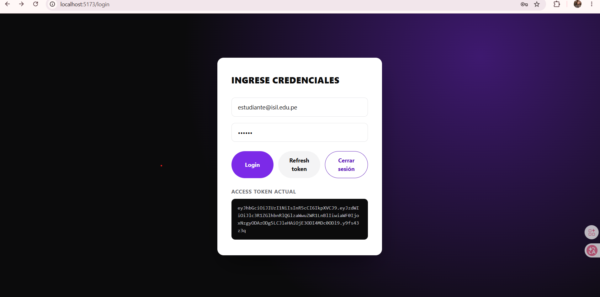
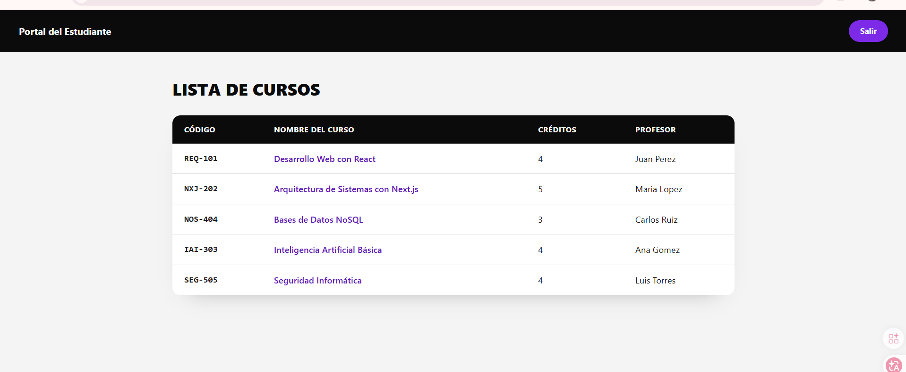
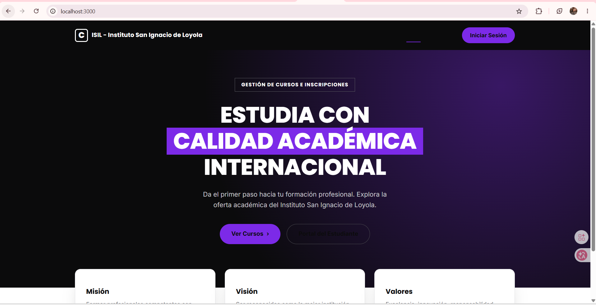

# Portal del Estudiante (React + Vite)

Aplicación React (SPA, sin Next.js) que implementa el portal del estudiante: login,
listado de cursos, detalle de curso y cierre de sesión, con autenticación basada
en token y rutas protegidas.

## Tecnologías
- React 19 + TypeScript
- Vite
- React Router DOM (rutas y rutas protegidas)
- Tailwind CSS v4
- Fetch API para consumo de datos

## Estructura
```
portal-estudiante-react/
├── src/
│   ├── api/            # authApi.ts, cursosApi.ts (consumo de API REST)
│   ├── components/      # RutaProtegida.tsx (guard de sesión)
│   ├── context/          # SessionContext.tsx (almacenamiento del token)
│   ├── pages/            # Login.tsx, Cursos.tsx, Detalle.tsx
│   ├── App.tsx
│   └── main.tsx
├── public/cursos.json    # datos de respaldo si no hay API externa
├── .env.example
└── package.json
```

## Variables de entorno
Copiar `.env.example` a `.env.local` y completar:

| Variable | Descripción |
|---|---|
| `VITE_API_URL` | URL base de la API REST (PA2). Si se omite, se usa `/cursos.json` local. |
| `VITE_SITIO_PUBLICO_URL` | URL del módulo público en Next.js (para enlazar entre apps). |

## Instalación y ejecución
```bash
npm install
npm run dev        # http://localhost:5173
```

## Build de producción
```bash
npm run build       # genera /dist
npm run preview     # sirve el build localmente
```

## Manejo de sesión y token
El token se guarda en `localStorage` bajo una única clave (`isil_portal_token`)
a través de `SessionContext`. `RutaProtegida` redirige a `/login` si no hay
token. El logout limpia explícitamente el `localStorage` y el estado en memoria.

## Credenciales de prueba
- Correo: `demo@lideratec.com`
- Clave: `123456`

## 🖼️ Capturas de Pantalla del Proyecto
Aquí puedes visualizar el avance del portal:

### Pantalla de Login


### Listado de Cursos


### Módulo Principal
